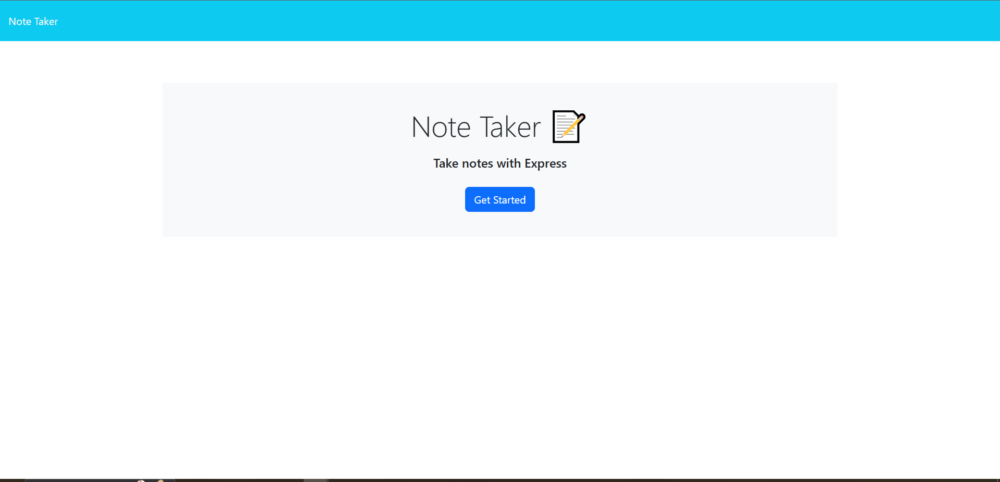

# Note Reminder

The Note Taker application is a simple web application built with Express.js. It allows users to write, save, and view notes. The app stores notes in a JSON file (db.json) and offers a user-friendly interface for adding and managing notes.

The app allows users to view existing notes, add new notes with a title and text, and delete notes.
Notes are saved with a unique ID, ensuring that each note is individually trackable.
This application has been deployed to Heroku and is available for use

## Installation

Before running this app locally, ensure that you have Node.js installed on your machine.

- [Download and install Node.js.](https://nodejs.org/en)

Clone the repository to your local machine.

- git clone git@github.com:gmtz0794/note-reminder.git

Navigate to Develop in the project folder and install the required dependencies using npm:

- cd note-remider
- cd Develop
- npm install

## Usage

To start the application locally, use the following command:

- npm start

This will start the server and allow you to visit the app at:

- http://localhost:3000

When you first visit the app, you will be presented with a landing page that includes a start button to the notes page. On the notes page, you will see a list of existing notes on the left side. On the right side, there are fields to enter a new note’s title and text. Enter a title and text for your new note. Click the "Save Note" button to add your note to the list. The note will appear in the left-hand column. Click on an existing note in the left-hand column to view its content in the right-hand column. To delete a note, click on the trash can icon next to the note you want to remove.

## License

MIT license